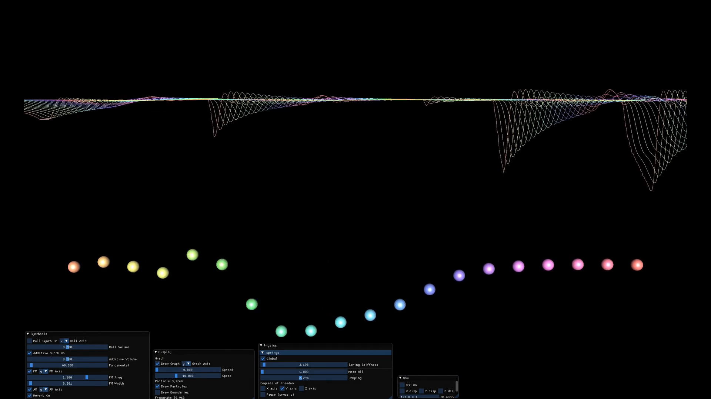

# CHON
Coupled Harmonic Oscillator Network (CHON) is a novel application for generating tactile sonic gestures
and textures using a simulation of a physical dynamical system as a musical interface. The physical system is
a network of particles connected by a spring-like force. The user sets the system into motion by displacing a
particle, which causes a chain reaction governed by Newtonian mechanics. The system generates complex yet
tangible control data that can be used to drive sound synthesis parameters.

The visual interface is a 3D rendering of the particle system. The user interacts directly with the particles
in the visual simulation using a computer mouse. A 2D graph can also be displayed which visualizes the
displacement of each particle along a given axis. The instrument generates a stream of OSC data from each
particle, making it a versatile tool for generating up to hundreds of control signals that are linked by physical
laws.

The application is written in C++ and uses the Allolib framework extensively.

# Building

## CHECK THE RELEASES PAGE FOR A COMPILED VERSION FOR YOUR OPERATING SYSTEM (https://github.com/rodneydup/CHON/releases)

### If you can't find one, or if you want to try compiling it yourself, follow the instructions below.

## Dependencies

terminal to run bash

git

cmake version 3.0 or higher

## How to setup
On a bash shell:

    git clone https://github.com/rodneydup/CHON
    cd CHON
    ./configure.sh
    ./run.sh

This will compile the project, and run the binary if compilation is successful.
